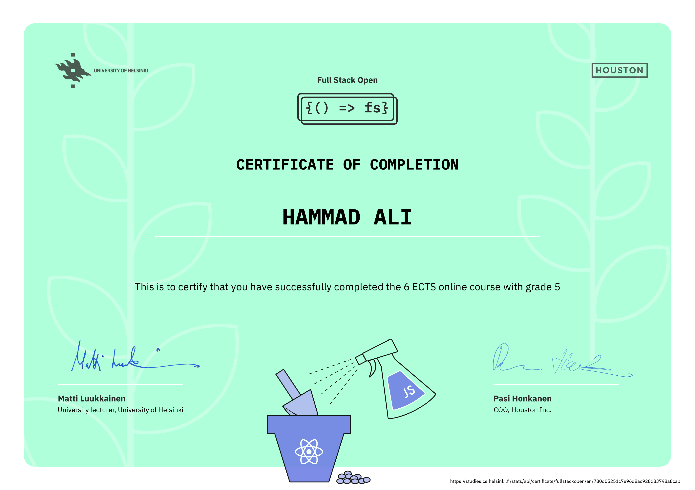

## Full Stack Open

This repository serves as my assignement submissions for Full Stack Open course offered by the University of Helsinki
https://fullstackopen.com/en/

Learn React, Redux, Node.js, MongoDB, GraphQL and TypeScript in one go! This course will introduce you to modern JavaScript-based web development. The main focus is on building single page applications with ReactJS that use REST APIs built with Node.js. It also has sections for the following

-  GraphQL, Facebook's alternative to REST for communication between browser and server
-  Typescript, an open-source typed superset of JavaScript developed by Microsoft that compiles to plain JavaScript.
-  React-Native, open-source framwork to build native Android and iOS mobile applications
-  CI/CD, Continuous integration (CI) and continuous delivery (CD)
-  Docker Containers, lightweight virtualization technology and an open-source app container engine that can easily package apps into portable containers.

### Course Certificates

